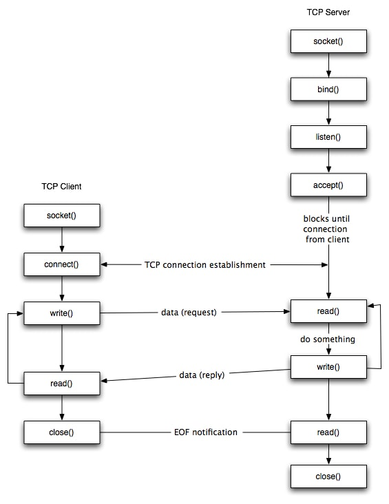

#### Linux Server - Client Networking 

Networking in Linux is handled by the Kernel like any I/O operation, and we can communicate to the Kernel using "system calls", which are basically a functions that the kernel exposes for us the "Users" to use in our application, to be able to communicate with the Kernel, and tell it what to do

example of a system call: "printf" which print text to the standard output, this function that is called from our application is actually calling a function in the Kernel, that is responsible for printing the Text to the standard output

In Linux, Networking is done by calling specific system calls provided by the Linux kernel, and let the kernel handle the actual networking, and sending data between PCs...etc

The networking system calls goes like this:
<br>


1. We first create a new socket using "Socket" system call
2. then we bind this socket to an address (Host + port number,  in our case), using "bind" system call
3. then we make our server be able to listen for any incoming connections, using "listen" system call
4. as soon as a client connects to us, we call "accept" system call, that will read the data that the client sent to us, this data is actually stored in a buffer like object in the kernel 
5. Now we will have a bidirectional connection between the Server and Client, where each party can send and receive messages to/form each other, using  "read"/"write"/"send"/"recv" system calls.
6. After the client is done communicating with the server, it will call "close", the server is also able to call "close".

These Steps will be implemented, and the code will almost be 1 : 1 replica to the above steps 
#### TCP Server Implementation

We first need an address to make the TCP server listens to, so the first thing we will do is to create an adddress, that will have the port number we want to listen to and the host. 

in Linux, there is a struct that tells the kernel what kind of address we want 
```cpp
// 1 - create our TCP socket address info which is required for furhter system calls to create the TCP socket

addrinfo tcpSocketAddressInfoHint;

addrinfo* tcpSocketAddressInfoResult;

tcpSocketAddressInfoHint.ai_family = AF_INET; // ipV4

tcpSocketAddressInfoHint.ai_socktype = SOCK_STREAM; // TCP

tcpSocketAddressInfoHint.ai_protocol = 0;

tcpSocketAddressInfoHint.ai_flags = AI_PASSIVE;

tcpSocketAddressInfoHint.ai_addr = NULL;

tcpSocketAddressInfoHint.ai_next = NULL;

tcpSocketAddressInfoHint.ai_canonname = NULL;
```

then we need to make a system call "getaddrinfo" , that will take as an input the address info  struct that we created, and will take the host name. as well as the port number,  and will give as some available addresses that we can bind our socket to.
we will get the available addresses in tcpSocketAddressInfoResult struct.

```cpp
getaddrinfo(NULL /* localhost */, "3331" /* port number*/, &tcpSocketAddressInfoHint, &tcpSocketAddressInfoResult);
```

then we need to loop over all available addresses returned from "getaddrinfo", and create a socket, then try to bind this socket to the available address till we successfully bind the socket 
```cpp
// 2 - we try each address in the tcp result info, till we can bind successfully

for(addrinfo* res = tcpSocketAddressInfoResult; res != NULL; res = tcpSocketAddressInfoResult->ai_next)

{
// 2.1 - create TCP socket file descriptor

int socketFD = socket(res->ai_family , res->ai_socktype, res->ai_protocol);

if(socketFD == -1)

continue; // Try next address

// 2.2 - bind the socket to the address

int err = bind(socketFD, res->ai_addr, res->ai_addrlen);

// .......rest of code goes here
}
```

if we bound to the address successfully, we can start listening for any incoming connections, using "listen" system call

```cpp
listen(socketFD, 5 /* Queue up to 5 connections */)
```

if a client connects to us, listen will return 0, and we can start accepting data from the client 

```cpp
// 2.4 accept the incoming connection

// create address for client that will be connected

sockaddr_in clientAddress;

socklen_t clientAddressSize = sizeof(clientAddressSize);

// when we accept a connection we will get back a file descriptor

// that can be used to communicate with the client

int newSocketFD = accept(socketFD,(sockaddr *)&clientAddress, &clientAddressSize);

std::cout<<"new Socket File Descriptor "<<newSocketFD<<"\n";
```

After calling accept, we will get a file descriptor that we can read and write data to, and the kernel will take care of sending this data to the client 

now, for simplicity sake, lets make all our server does is, accept a message from client, then send a message to the client, then close the connection.

```cpp
std::cout<<"A Client Has Connected\n";

// create a buffer to store the bytes sent from the client

constexpr const unsigned int MAX_BUFF_SIZE = 256;

char buffer[MAX_BUFF_SIZE];

  

// get bytes sent from client if there are any

int numberOfBytesRead = recv(newSocketFD, buffer, MAX_BUFF_SIZE, 0 );

if(numberOfBytesRead > 0)

{

  

// the client sent something to us

// for now we just reply back to him and close the connection so we can connect to other clients

// add null terminator to the string

*(buffer+numberOfBytesRead) = '\0';

std::cout<<"Recieved from client "<<numberOfBytesRead<<" Bytes\nThe Client Says: "<<buffer<<"\n";

// send to client that we got his message

strcpy(buffer, "I recieved your message and will close connection now\n");

send(newSocketFD, buffer, strlen(buffer), 0 );

close(newSocketFD);
```

And that's it, this is our simple TCP server 

we can test it, by building it using g++, and running it

```
g++ -std=c++17 blocking_server.cpp
```

```
./a.out 
```

we will get in the output 
```
Listening For Incoming Connections

```

and the program will block till  a client connects, by using netcat, we can connect to the server and send a simple "hello" message 

```
echo "HI Server" | netcat   localhost 3331
```

as soon as we send the message we get in the server standard output:
```
new Socket File Descriptor 4
A Client Has Connected
Recieved from client 10 Bytes
The Client Says: HI Server
```

and in the client we get:

```
I recieved your message and will close connection now
```

so it seems that everything works perfectly and we didn't need polling or multi-threading, well actually it only worked well cause we had only one concurrent client, but imagine having a hundreds of requests at the same time, out server won't be able to handle them all at once, as from the code we can see we serve one client at a time, as there is only one execution thread, which is the main thread, and each time we have a client connect to us, we need to block the main thread as we wait for this client to send some data to us, so we can close the connection to this client, and connect to some other client.

Of course this is not acceptable in a real world server, that needs to handle hundred of requests per second, and we can't have the risk of blocking the main thread to serve a client, we will see  how we can handle this road block in the next part  